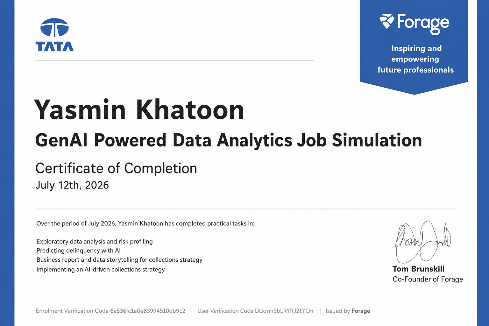

# Tata GenAI Powered Data Analytics Job Simulation (Forage)

This repository contains my completed Tata Group GenAI Powered Data Analytics Job Simulation hosted by Forage.

## Skills Demonstrated

- Python
- Pandas
- Data Cleaning
- Exploratory Data Analysis (EDA)
- Risk Profiling
- Predictive Analytics
- Business Reporting
- AI-powered Collections Strategy
- Data Storytelling

## Business Problem

Predicted customer delinquency risk using exploratory analysis and proposed an AI-driven collections strategy.

## Repository Structure

...

## Certificate

